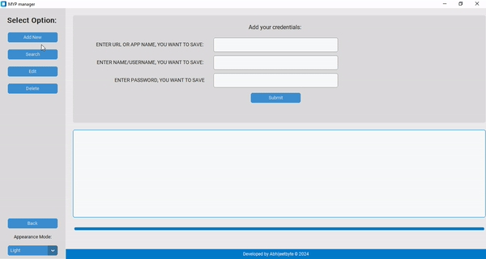

    <!--<h1 align="center">One8Manager</h1>-->
    <h4 align="center">
      A fast and dead-simple password/credential manager app
    </h4>
   

The " One8 Manager " allows users to securely store and manage their passwords and other sensitive information, using encryption to protect the data locally (more securely). The application includes features such as the ability to add, edit, and delete credentials and search for credentials based on specific criteria.

The code is well-organized and easy to read, with clear comments and explanations of each section of the code. The application has a user interface, which includes a main window with tabs for managing credentials and various buttons for performing actions such as adding or deleting credentials.
This is useful for managing personal passwords and other sensitive information. The code is well-written and easy to modify to fit specific needs or to add additional functionality.

 

## Features
* Standard Password manager offers basic operations like **Add**, **Search**, **Edit** and **Delete** etc
* Only need to remember the Master Password for all your saved credentials
* Does not save your Master Password on your computer or **anywhere**
* Saves your passwords in encrypted form, **locally**
* Auto Backup as `.csv` file
* Available in both Portable (require no installation) and Windows Installer 
 

## Getting started

<b>Prerequisites</b>:

* Your computer must be running Python3 or newer.
* The script requires [pandas](https://pandas.pydata.org/docs/index.html), [pwinput](https://pypi.org/project/pwinput/) and [tabulate](https://pypi.org/project/tabulate/) libraries installed.  
   - Open Terminal and run `pip install pandas` to install pandas library  
   - run `pip install tabulate` and `pip install pwinput` to install the library 

* The script requires [Tkinter](https://docs.python.org/3/library/tkinter.html) and [CustomTkinter](https://customtkinter.tomschimansky.com/) libraries  for the **GUI** version of the script
    - run `pip install tk` and `pip install customtkinter` to install the library
  
* Get the source [code](https://github.com/SandeepImandi01/One8Manager/archive/refs/heads/main.zip)

* Extract the zip and open <b> main.py</b> or <b> GUI_main.py</b> in Python IDE to build and run the Password Manager app. 

## Download

[Latest stable release.](https://github.com/Sandeepimandi/One8Manager/releases/latest)

Releases and prereleases contain links to standalone packages
(and installers for full releases) for Windows
  
_Your computer must be running Windows 10 or newer._

* Install the latest version of the Application. [Download v2.0](https://github.com/Sandeepimandi/One8Manager/releases/download/v2.0/One8Manager_setup.exe)
* Portable version [Download v2.0](https://github.com/Sandeepimandi/One8Manager/releases/download/v2.0/One8Manager.exe)

 

## Intro

 

## Uses

 

## Reporting Issues & Contributions

Feel free to report <b>[issues](https://github.com/Sandeepimandi/One8Manager/issues/new)</b> and <b>contribute</b> to this repository

## License

Copyright © 2024 Sandeep Imandi. All rights reserved.

Licensed under the [CC0-1.0 License](LICENSE).
